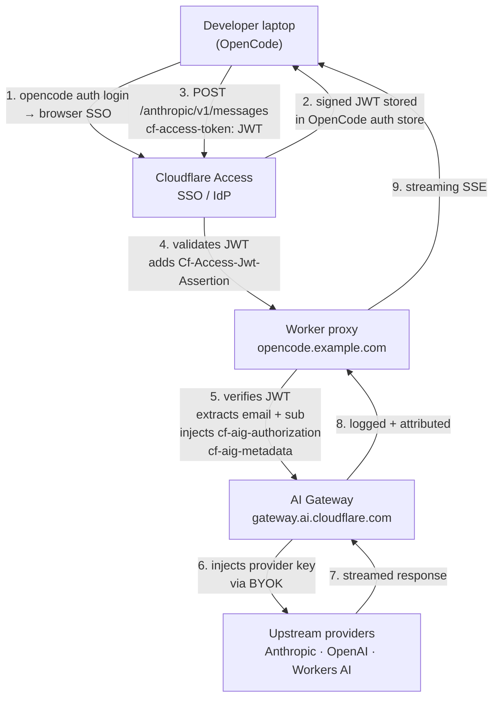

# cf-ai-gateway-worker-proxy

A Cloudflare Worker that acts as a secure, stateless proxy between [OpenCode](https://opencode.ai) (or any OpenAI-compatible AI coding agent) and [Cloudflare AI Gateway](https://developers.cloudflare.com/ai-gateway/). Every request is authenticated via Cloudflare Access (Zero Trust), and per-user identity is injected into AI Gateway logs for cost attribution — without storing any API keys on developer machines.

Inspired by [The AI engineering stack we built internally](https://blog.cloudflare.com/the-ai-engineering-stack-we-built-internally/) and the [opencode-partners](https://gitlab.com/cloudflare/opencode-partners) reference implementation.

---

## Architecture



### Why a proxy Worker?

The Worker is the control plane. Routing every client through a single Worker lets you add per-user attribution, model catalog management, and permission enforcement later — without touching any client config. Provider API keys never leave Cloudflare infrastructure.

---

## Prerequisites

- Cloudflare account with a **domain on Cloudflare DNS**
- Cloudflare **Zero Trust** organization connected to an IdP (Okta, Entra, Google, etc.)
- **AI Gateway** created with:
  - Authenticated Gateway enabled (save the token)
  - BYOK configured for each provider you want to use (Anthropic, OpenAI, Workers AI)
- `wrangler` CLI installed (`npm i -g wrangler`)
- `opencode` installed on developer machines (`brew install anomalyco/tap/opencode`)

---

## Deployment guide

### Step 1 — Create the AI Gateway

Dashboard → **AI** → **AI Gateway** → **Create**.

Enable **Authenticated Gateway** and copy the token — this becomes the `AIG_TOKEN` secret.

Under **Provider Keys**, add your BYOK keys for Anthropic, OpenAI, etc. The Worker does **not** hold provider keys; AI Gateway injects them.

Locate your IDs from the dashboard URLs:

```
# ACCT_ID — visible in every dashboard URL
https://dash.cloudflare.com/6f2080ef32037479675c83f1fe86bef3/home
                             ^^^^^^^^^^^^^^^^^^^^^^^^^^^^^^^^
                             ACCT_ID = "6f2080ef32037479675c83f1fe86bef3"

# GW_ID — visible in the AI Gateway endpoint URL
https://gateway.ai.cloudflare.com/v1/6f2080ef32037479675c83f1fe86bef3/playground/anthropic/...
                                                                        ^^^^^^^^^^
                                                                        GW_ID = "playground"
```

---

### Step 2 — Configure and deploy the Worker

Edit `wrangler.jsonc` and fill in your values:

```jsonc
{
  "routes": [{ "pattern": "opencode.example.com", "custom_domain": true }],
  "vars": {
    "ACCESS_TEAM": "yourteam",                    // yourteam.cloudflareaccess.com
    "ACCT_ID": "6f2080ef32037479675c83f1fe86bef3",
    "GW_ID": "playground"
  }
}
```

Install dependencies and deploy:

```bash
npm install
wrangler secret put AIG_TOKEN   # Authenticated Gateway token
wrangler deploy
```

> `ACCESS_AUD` is set in Step 4, after the Access application is created.

---

### Step 3 — Disable WAF on the Worker custom domain

> ⚠️ **Critical** — without this step, the WAF blocks requests to the Worker and clients receive `403 Forbidden`.

Dashboard → your domain zone → **Security** → **WAF** → add a **Custom Rule** or a **Configuration Rule** to skip WAF for the Worker hostname (`opencode.example.com`).

Alternatively: Dashboard → **Workers & Pages** → your Worker → **Settings** → verify that no managed WAF rules apply to the custom domain.

---

### Step 4 — Create Access Application #1 — Allow (protected routes)

Zero Trust → **Access** → **Applications** → **Add a Self-hosted application**

| Field | Value |
|---|---|
| Application name | `OpenCode Proxy` |
| Subdomain | `opencode` |
| Domain | `example.com` |
| Path | *(empty — covers all routes)* |
| Policy action | **Allow** |
| Policy rule | Email domain / IdP group of your org |

After saving, go to the application **Details** tab and copy the **Application Audience (AUD) tag** — a 64-character hex string.

```bash
wrangler secret put ACCESS_AUD   # paste the AUD tag
```

Also note your Access team domain:

```
# ACCESS_TEAM — the subdomain of your Zero Trust organization
https://yourteam.cloudflareaccess.com
        ^^^^^^^^^^
        ACCESS_TEAM = "yourteam"
```

---

### Step 5 — Create Access Application #2 — Bypass (discovery endpoint)

The `/.well-known/opencode` endpoint must be **publicly accessible** — OpenCode fetches it before authenticating to read the provider config and auth command.

Add a **second** Self-hosted application:

| Field | Value |
|---|---|
| Application name | `OpenCode Discovery` |
| Subdomain | `opencode` |
| Domain | `example.com` |
| **Path** | `/.well-known/opencode` |
| Policy action | **Bypass** |
| Policy rule | **Everyone** |

> Access matches the most specific path first. The Bypass app wins for `/.well-known/opencode`; the Allow app covers everything else.

---

### Step 6 — User onboarding

One-time setup on each developer machine:

```bash
brew install cloudflared anomalyco/tap/opencode

# Authenticate — opens browser SSO, stores JWT in OpenCode auth store
opencode auth login https://opencode.example.com

# Launch
opencode
```

No API keys. No provider config. Everything is pushed from the Worker's discovery endpoint.

If you already have an OpenCode configuration with a `cloudflare-ai-gateway` native provider, disable it to ensure all requests route through the proxy:

```bash
# ~/.config/opencode/opencode.json
{
  "$schema": "https://opencode.ai/config.json",
  "disabled_providers": ["cloudflare-ai-gateway"]
}
```

---

## Secrets reference

| Secret | How to set | Description |
|---|---|---|
| `AIG_TOKEN` | `wrangler secret put AIG_TOKEN` | Authenticated AI Gateway token (`cf-aig-authorization`) |
| `ACCESS_AUD` | `wrangler secret put ACCESS_AUD` | Access Application Audience tag (64-char hex) |

Provider API keys (Anthropic, OpenAI, Workers AI) are configured in AI Gateway via BYOK — they never pass through this Worker.

---

## Token renewal

The Access JWT is valid for the session duration configured in your Access application (typically 24 hours to 30 days). When it expires, re-authenticate:

```bash
opencode auth login https://opencode.example.com
```

---

## Lessons learned

### `cloudflared access login` does not work with Workers custom domains

`cloudflared access login` is designed for apps served via Cloudflare Tunnel — cloudflared is in the routing path and can intercept the JWT callback. For self-hosted apps on Workers custom domains, cloudflared is not in the routing path and fails to detect the Access application.

**Workaround:** The Worker serves a `/auth/token` endpoint (behind Access) that returns the `Cf-Access-Jwt-Assertion` header as plain text. The discovery doc's auth command opens this page in a browser and reads the JWT from the clipboard via a polling loop.

### WAF blocks requests to the Worker proxy

Cloudflare's WAF applies to custom domains on Workers and will block requests before they reach the Worker runtime. This causes `403 Forbidden` responses that look identical to Access policy blocks.

**Fix:** Disable or skip WAF rules for the Worker's custom domain hostname.

### Two Access applications are required

A single Access application cannot selectively bypass a path — policy rules control identity (who), not path (what). To make `/.well-known/opencode` public while protecting all other routes, you need two separate Self-hosted applications on the same hostname with different path configurations.

### Strip hop-by-hop headers when proxying streaming responses

Forwarding `content-encoding` and `transfer-encoding` headers from the upstream response to the client breaks SSE streaming. Rebuild the response object explicitly:

```typescript
const responseHeaders = new Headers(response.headers);
responseHeaders.delete("content-encoding");
responseHeaders.delete("transfer-encoding");
return new Response(response.body, { status: response.status, headers: responseHeaders });
```

### `opencode debug config` shows empty token

`{env:TOKEN}` in the provider headers config is resolved at request time from OpenCode's internal auth store, not from shell environment variables. `debug config` shows the raw (unresolved) value — an empty string is expected and does not indicate a missing token.

---

## Headers reference

| Header | Direction | Purpose |
|---|---|---|
| `cf-access-token` | Client → Worker | Access JWT sent by OpenCode on every request |
| `Cf-Access-Jwt-Assertion` | Access edge → Worker | Verified JWT injected by Cloudflare Access — used for Worker-side validation |
| `cf-aig-authorization` | Worker → AI Gateway | Authenticated Gateway token |
| `cf-aig-metadata` | Worker → AI Gateway | Per-request attribution: `{"user": "email", "sub": "id", "client": "opencode"}` |
| `Authorization` | AI Gateway → Provider | Provider API key injected by AI Gateway via BYOK |

---

## References

- [Cloudflare AI Gateway docs](https://developers.cloudflare.com/ai-gateway/)
- [AI Gateway — Authenticated Gateway](https://developers.cloudflare.com/ai-gateway/get-started/connecting-applications/#authenticated-gateway)
- [AI Gateway — Custom metadata](https://developers.cloudflare.com/ai-gateway/observability/custom-metadata/)
- [Cloudflare Access — Validating JWTs in Workers](https://developers.cloudflare.com/cloudflare-one/identity/authorization-cookie/validating-json/#cloudflare-workers-example)
- [OpenCode config docs](https://opencode.ai/docs/config/)
- [Blog: The AI engineering stack we built internally](https://blog.cloudflare.com/the-ai-engineering-stack-we-built-internally/)
